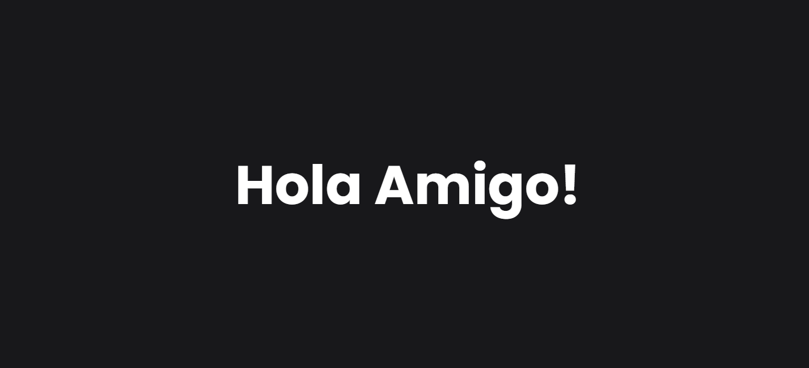
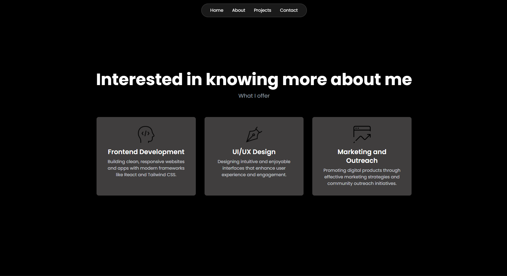

# My Personal Website



A modern, responsive personal portfolio website built with React and Tailwind CSS. This project showcases my skills as a frontend developer and provides an interactive platform to display my work, services, and contact information.

## 🛠️ Tech Stack

- **Frontend**: React 18, Tailwind CSS
- **Icons**: React Icons
- **Build Tool**: Create React App
- **Styling**: Custom CSS with Tailwind utilities

## 📋 Sections

The website includes the following sections:

1. **Intro**: Animated welcome screen
2. **Hero**: Personal introduction with call-to-action buttons
3. **About**: Services offered (Frontend Development, UI/UX Design, Marketing)



4. **Projects**: Showcase of work with tech stack carousel
5. **Contact**: Direct email contact form
6. **Footer**: Navigation links and social media connections

## 🏃‍♂️ Getting Started

### Prerequisites

- Node.js (v14 or higher)
- npm or yarn

### Installation

1. Clone the repository:
```bash
git clone https://github.com/vaibhav09981/my-personal-website.git
```

2. Navigate to the project directory:
```bash
cd my-personal-website
```

3. Install dependencies:
```bash
npm install
```

4. Start the development server:
```bash
npm start
```

The website will open at [http://localhost:3000](http://localhost:3000).

### Build for Production

```bash
npm run build
```

## 📧 Contact

Feel free to reach out for collaborations, opportunities, or just to say hello!

- **Email**: vaibhavjj99@gmail.com
- **LinkedIn**: [Vaibhav Jamloki](https://www.linkedin.com/in/vaibhav-jamloki/)
- **GitHub**: [vaibhav09981](https://github.com/vaibhav09981)

## 📄 License

This project is open source and available under the [MIT License](LICENSE).

---

Made with ❤️ by Vaibhav Jamloki
